# Repaso BBDD 2º trimestre

## Backend 101

Este trimestre nos hemos centrado en aprender a crear aplicaciones web en el lado del servidor. Hemos aprendido a crear rutas, manejar solicitudes y respuestas, y a usar middlewares y vistas.

---
## Introducción

A principios de 1945, Vannevar Bush publicó un artículo en la revista The Atlantic Monthly titulado "As We May Think". En este artículo, Bush propuso un sistema de almacenamiento y recuperación de información que llamó "memex". 

---


El memex era un dispositivo mecánico que almacenaba y recuperaba información en microfilm. El usuario podía navegar por la información utilizando un teclado y una pantalla.

---

## Hipertexto

El hipertexto es un sistema de escritura que permite a los usuarios navegar por la información de manera no lineal. El hipertexto se basa en la idea de que la información se puede organizar en una red de nodos y enlaces.

---

## FRESS

En 1960, Ted Nelson desarrolló un sistema de hipertexto llamado FRESS (File Retrieval and Editing System). FRESS permitía a los usuarios crear, editar y navegar por documentos de texto utilizando enlaces. FRESS fue uno de los primeros sistemas de hipertexto y es considerado como un precursor de la web.

---

## WWW

En 1989, Tim Berners-Lee propuso un sistema de hipertexto llamado World Wide Web (WWW). El WWW fue diseñado para permitir a los usuarios navegar por la información de manera no lineal. En 1990 se crea la primera página web y en 1993 se lanza el primer navegador web de uso general.

---
<!-- class: lead -->

## Web 1.0



La estructura de la web 1.0 es simple, disponemos de un servidor que almacena documentos de hipertexto y un cliente que los visualiza, podemos acceder a los documentos mediante enlaces (anchors).

---
<!-- class: invert -->

## Solo lectura

La web 1.0 es un sistema de hipertexto que permite a los usuarios **consumir** información de manera no lineal, pero es un sistema de **solo lectura**. Los usuarios no pueden **crear** ni **editar** la información. Es la web que se usaba en los años 90.

---

<!-- class: lead -->
## Web tradicional


HTML 2.0 (1995) introdujo **formularios**, que permiten a los usuarios enviar datos al servidor. 
Este ahora es un sistema de hipertexto que permite a los usuarios **consumir**, **crear** y **editar** información de manera no lineal.

---
<!-- class: invert -->

## AJAX

En el año 1999 se introduce la tecnología **XMLHttpRequest** (XHR) que permite a los clientes enviar y recibir datos del servidor desde el cliente en javascript. 
Esto permitió a los clientes **consumir**, **crear** y **editar** información de manera no lineal, ahora sin necesidad de recargar la página.

---
<!-- class: lead -->

## SPA 

(Single Page Application)

La aparición de AJAX permitió a los desarrolladores crear aplicaciones web que funcionan como aplicaciones de escritorio. Estas aplicaciones se cargan en una sola página y se actualizan dinámicamente a medida que el usuario interactúa con ellas.


---
<!-- class: invert -->

## Tecnologias AJAX

- **XMLHttpRequest** (XHR) (1999)
- **JSON** (2001)
- **XML** (2001)
- **AJAX** (2005)
- **Fetch API** (2015)
- **Promises** (2015)
- **Async/Await** (2017)

---

## Frameworks SPA

- **React** (2013)
- **Vue** (2014)
- **Angular** (2016)

---

## Hypermedia Driven Apps

Las aplicaciones Hypermedia Driven se centran en ampliar las capacidades del propio lenguaje `HTML` evitando la necesidad de utilizar tecnologías adicionales como `AJAX` o frameworks como `React` o `Vue`.

Las HDA nos permiten **consumir**, **crear** y **editar** información de manera no lineal, sin necesidad de recargar la página, utilizando únicamente `HTML`. 

---

## Agnosticidad

Las aplicaciones Hypermedia Driven son **agnosticas** al servidor, es decir, no necesitan conocer la estructura de los datos ni la lógica de negocio del servidor para poder **consumir**, **crear** y **editar** información.

Esto hace que las aplicaciones Hypermedia Driven sean **más flexibles** y **fáciles de mantener** que las aplicaciones tradicionales.

---

## NodeJS

NodeJS es un entorno de ejecución de JavaScript que permite a los desarrolladores crear aplicaciones de servidor en JavaScript utilizando el motor de JavaScript V8 de Google Chrome para ejecutar código JavaScript en el servidor.

Node nos permite lanzar scripts localmente mediante

`node script.js`

Si lanzas `node` sin argumentos, se abrirá un terminal interactivo donde puedes ejecutar código javascript directamente.

---

Tambien incluye varios modulos como:

- [Importaciones](https://dambbdd.neocities.org/04_nodejs/01_modulos)
- [filesystem](https://dambbdd.neocities.org/04_nodejs/02_filesystem)
- [path](https://dambbdd.neocities.org/04_nodejs/path)
- [os](https://dambbdd.neocities.org/04_nodejs/03_os)
- [http](https://dambbdd.neocities.org/04_nodejs/04_http)

---

Podemos instalar otros modulos y librerias mediante diferentes gestores como `npm` o `yarn`.

`npm init -y` nos deja iniciar rapidamente un proyecto con npm.

Esto creará un `package.json` con la información del proyecto.

Puedes instalar modulos con `npm install nombre_del_modulo` y luego usarlos en tu proyecto.

Si quieres instalar un modulo para usarlo solo en desarrollo, puedes usar `npm install nombre_del_modulo -D`.

---

```json
{
  "name": "backend101",
  "version": "1.0.0",
  "description": "",
  "main": "index.js",
  "scripts": {
    "test": "echo \"Error: no test specified\" && exit 1",
    "start": "node index.js"
  },
  "keywords": [],
  "author": "",
  "license": "ISC"
}
```

La sección de scripts nos deja definir comandos que podemos usar en la terminal, por ejemplo, `npm start` ejecutará el comando que tengamos en `start`.

---

## Express

Express es un framework de aplicaciones web para Node.js. Es minimalista y flexible, proporciona un conjunto de características robusto para desarrollar aplicaciones web y móviles.

Es muy ligero, ya que no incluye muchas características, en su lugar, estas características se añaden mediante middlewares a nuestra aplicación.

Nos dejará crear diferentes endpoints para nuestra aplicación, manejar solicitudes de nuestro cliente, ejecutar código y librerias de otros modulos, y enviar respuestas a nuestro cliente.

---

# Hola mundo

Iniciar un servidor es fácil

```javascript
const express = require('express');
const app = express();

app.get('/', (req, res) => {
  const { nombre } = req.query
  res.send(`Hola ${nombre}!`);
});

app.listen(3000, () => {
  console.log('Example app listening on port 3000!');
});
```

---
En el ejemplo:
1. Importamos el modulo `express` y lo guardamos en la constante `express`.
2. Creamos una aplicación de express y la guardamos en la constante `app`.
3. Definimos una ruta `GET /` que captura el dato `nombre` del query y envia un saludo.
4. Iniciamos el servidor en el puerto 3000.
---
# Request

El objeto request que manejamos en nuestros endpoints corresponde a la solicitud que nos hace el cliente, contiene información que nos será más o menos util segun nuestro endpoint.

Cualquier request se compone de:
- `req.params` para capturar parametros de la url
- `req.query` para capturar parametros de la query
- `req.body` para capturar parametros del body
- `req.headers` para capturar los headers de la solicitud

---
# Response

El objeto response que manejamos en nuestros endpoints corresponde a la respuesta que le damos al cliente, este tiene un `body` que es el contenido de la respuesta y un `status` que es el código de estado de la respuesta.

- `res.set()` para configurar un header en particular
- `res.send()` para enviar una respuesta simple.
- `res.json()` para enviar una respuesta en formato json.
- `res.sendFile()` para enviar un archivo (html, css, js, etc).
- `res.render()` para renderizar una vista y enviarla al cliente.

---

## Headers

La solicitud y la respuesta incluyen mucha información en sus headers, algunos de los datos que nos pueden ser útiles:

- `req.headers['accept']` para capturar el tipo de contenido que acepta el cliente, por ejemplo `text/html` o `application/json`
- `req.headers['user-agent']` para capturar el agente de usuario, por ejemplo `Mozilla/5.0 (Windows NT 10.0; Win64; x64) AppleWebKit/537.36 (KHTML, like Gecko) Chrome/58.0.3029.110 Safari/537.3`
- `req.headers['host']` para capturar el host de la solicitud, por ejemplo `localhost:3000` o `www.google.com`

---

Algunos ejemplos creando headers para la respuesta:

- `res.set('Content-Type', 'text/html')` para configurar el tipo de contenido que enviaremos al cliente.
- `res.set('Location', '/nueva_ruta')` para configurar la nueva ubicación de la solicitud, por ejemplo, si estamos redirigiendo al usuario a una nueva ruta.
- `res.set('Cache-Control', 'no-cache')` para configurar la cache de la solicitud, por ejemplo, si no queremos que se cachee la respuesta.

---

## Rutas

Las rutas son una forma de definir las URLs a las que responde nuestra aplicación. 

```javascript
app.get('/', (req, res) => {
  res.send('Hello World!');
});
```

Cada ruta consta de:
- Un método HTTP
- Una URL
- Una función que maneja la petición y da una respuesta

---
## Rutas con parámetros

Podemos definir rutas con **parametros en la url** y capturarlos con `req.params`

```javascript
app.get('/pokemon/:id', (req, res) => {
    const id = req.params.id;
    const pokemon = getPokemon(id)
    res.send(pokemon);
});
```

En el ejemplo, el usuario debe mandar la solicitud `GET /pokemon/1`

---
## URL query

De forma similar, un usuario puede mandar datos desde la url mediante los `URL queries`.

`GET /mensajes?id=12` envía el dato `id` con el valor `12`

`GET /mensajes?autor="admin"&fecha="2022-01-01"` envía los datos `autor` y `fecha` con los valores `admin` y `2022-01-01` respectivamente.

---

Podemos capturar **parametros de la query** mediante `req.query`

```javascript
app.get('/pokemon', (req, res) => {
    const id = req.query.id;
    const pokemon = getPokemon(id)
    res.send(pokemon);
});
```

El usuario puede llamar al endpoint añadiendo sus datos asi: 
`GET /pokemon?id=1`
`GET /pokemon?id=12`
`GET /pokemon?id=6`

---

También podemos capturar parametros de la query mediante `req.body`, esto se hace cuando nos llegan datos de un `<form>` o con `AJAX` mediante un `POST`.

```javascript
app.post('/mensajes', (req, res) => {
    const mensaje = req.body.mensaje;
    if(!mensaje) return res.status(400).json({error: 'mensaje vacio'});
    addMensaje(mensaje);
    res.json({mensaje: mensaje, status: 200});
});
```

---

# Envio de datos

Ya sabeis como capturar los datos que envia el usuario en nuestros endpoints, pero, ¿como enviamos datos al servidor?

Tenemos varias formas:
- Mediante un `<form>`
- Mediante `XMLHttpRequest`
- Mediante `fetch`
- Mediante `htmx`

---
## Envio mediante `<form>`

```html
<form action="/mensajes" method="post">
  <input type="text" name="mensaje">
  <input type="submit" value="Enviar">
</form>
```
    
- Necesitaremos configurar `action` y `method` en el `<form>` con la ruta y método HTTP correspondientes.
- Cada `<input>` debe tener un `name` que será el nombre del parametro que se enviará, junto al valor que ingrese el usuario en el `<input>`.

---
## Envio mediante `XMLHttpRequest`

```javascript
const xhr = new XMLHttpRequest();
xhr.open('POST', '/mensajes', true);
xhr.setRequestHeader('Content-Type', 'application/x-www-form-urlencoded');
xhr.send('mensaje=Hola');
```
1. Creamos un objeto xhr.
2. Abrimos una conexión con el método `POST` y la ruta `/mensajes`, establecemos `true` para que sea asincrono.
3. Creamos nuestro header.
4. Enviamos los datos mediante `xhr.send()`

---
Podemos capturar la respuesta mediante `xhr.onload` o `xhr.onreadystatechange` y trabajar con la respuesta manipulando el DOM.

```javascript
xhr.onload = function() {
  if (xhr.status >= 200 && xhr.status < 300) {
    console.log('success!', xhr.responseText);
    //Modifica el DOM con la respuesta
  } else {
    console.log('The request failed!');
    //Modifica el DOM con el error
  }
};
```

  
---
## Envio mediante `fetch`

Fetch nos deja hacer peticiones de manera mas simple que `XMLHttpRequest`:

```javascript
fetch('/mensajes', {
  method: 'POST',
  headers: {
    'Content-Type': 'application/x-www-form-urlencoded'
  },
  body: 'mensaje=Hola&autor=admin'
})
.then(response => response.json())
.then(data => manipulaRespuesta(data));
```

---
## fetch + json
`fetch` nos deja enviar y recibir datos en formato `json` de manera mas simple que `XMLHttpRequest`:

```javascript
fetch('/mensajes', {
  method: 'POST',
  headers: {
    'Content-Type': 'application/json'
  },
  body: JSON.stringify({mensaje: 'Hola'})
})
.then(response => response.json())
.then(data => manipulaRespuesta(data));

const manipularRespuesta = (data) => {}
```

---
En todos estos casos, si en nuestra ruta queremos capturar el parametro `mensaje` del `body`, deberemos usar el middleware `express.urlencoded` para parsear el `body` de la solicitud.

```javascript
app.use(express.urlencoded({ extended: true }));
```
---

Podemos usar varias solicitudes HTTP para la misma ruta

```javascript
const libros = [
  { id: 1, titulo: 'El problema de los tres cuerpos' },
  { id: 2, titulo: 'El alquimista y la puerta de acero' },
  { id: 3, titulo: 'Snuff' }
];
app.use(express.urlencoded({ extended: true }));
app.get('/libro/:id', (req, res) => {
    const libro = libros.find(libro => libro.id === parseInt(req.params.id));
    res.json(libro);
  })
app.post('/libro', (req, res) => {
    const libro = req.body.titulo;
    libros.push({ id: libros.length + 1, titulo: libro });
    res.send('Libro añadido');
  })
app.put('/libro', (req, res) => {
    const id = req.body.id;
    const libro = req.body.titulo;
    libros[id - 1] = { id: id, titulo: libro };
    res.send('Libro actualizado');
  });
```

---

## Routers

Los routers nos dejan dividir nuestra aplicacion en modulos mas pequeños.

Simplifican la forma en la que estructuramos la aplicación, agrupando endpoints en archivos separados y usandolos luego en nuestro archivo principal.

```
/root
  index.js
  /routes
    test.js
    mensajes.js
```

---

Necesitarás crear un archivo donde hagas todas las rutas que quieras usar y exportarlas:

```javascript
// ./routes/test.js
const express = require('express');
const router = express.Router();

router.get('/', (req, res) => {
  res.send('Hello World!');
});

module.exports = router;
```
---
Y luego importarlas y usarlas en tu servidor:
```javascript
//en tu archivo principal
const express = require('express');
const app = express();

const routerTest = require('./routers/test');
const routerMensajes = require('./routers/mensajes');
app.use('/mensajes', routerMensajes);
app.use(routerTest);

app.listen(3000, () => {
  console.log('Example app listening on port 3000!');
});
```

---

## Middlewares

Los middlewares son funciones que se ejecutan antes de que se ejecute la función que maneja la petición.

Podemos usar middlewares para:
- Validar datos
- Autenticar usuarios
- Loggear peticiones
- Manejar errores

---

```javascript
app.use((req, res, next) => {
  console.log('Time:', Date.now());
  next();
});
```

En este ejemplo, el middleware loggea la fecha y hora de la solicitud y luego llama a `next()` para que se ejecute la función que maneja la petición o el siguiente middleware.

---

```javascript
app.use((req, res, next) => {
  if (!req.headers['api-key']) {
    res.status(401).send('Unauthorized');
  } else {
    next();
  }
});
```

---

Podemos crear middleware en forma de funciones y usarlas en nuestras rutas.

```javascript
function loggea(req, res, next){
    console.log('Time:', Date.now());
    next();
}

app.use(loggea);
```

En este caso, configuramos todas las rutas para usar el middleware que hemos creado.

---

Tambien podemos usarlo solo en una ruta en particular.

```javascript
app.get('/libro', loggea, (req, res) => {
    const libro = libros[Math.floor(Math.random() * libros.length)];
    res.json(libro);
  })
```

En este caso, solo la ruta `/libro` usará el middleware `loggea`.

Usar middlewares nos permite reutilizar código y mantener nuestras rutas limpias y fáciles de leer.

---

Tenemos varios middlewares que vienen incluidos con `Express`, entre ellos:

- `express.json()`, para parsear el `body` de la solicitud en formato `json`.
- `express.urlencoded()`, para parsear el `body` de la solicitud en formato `x-www-form-urlencoded`.
- `express.static()`, para servir archivos estáticos.
- `express.Router()`, para crear rutas modulares.

---

Tambien podemos descargar middlewares de terceros como `morgan`, `cors`, `express-session`.

Instalalos mediante `npm install nombre_del_middleware` y luego usalos mediante `app.use()` como con los middlewares anteriores.

---

Algunos middleware de terceros necesitarán configuración adicional, por ejemplo, con morgan debemos definir el formato de loggeo que queremos usar.

```javascript
const morgan = require('morgan');
app.use(morgan('tiny'));
```

---

En el caso de express-session necesita un hash secreto y las opciones deseadas: 

```javascript
const session = require('express-session');
app.use(session(
    { 
    secret: 'qwerty', 
    resave: false, 
    saveUninitialized: true 
    }));
```

`resave` hace que la sesión se guarde en el servidor en cada solicitud, `saveUninitialized` hace que se guarde la sesión aunque no haya sido modificada y `secret` es el hash secreto que se usará para firmar la cookie de la sesión.

---

## Vistas

Podemos usar `HTML` junto a `res.sendFile()` para enviar archivos estaticos, pero Express nos permite usar vistas para enviar archivos `HTML` de manera dinámica.

Las vistas utilizan lenguajes de `templating` como `pug`, `ejs`, `handlebars` o `nunjucks` son archivos que pueden generar código `.html` de manera dinámica, en las que podemos definir una estructura html sin contenido, y luego mandarle datos desde el servidor para que los complete y convierta a `html`.

---

Para usar las vistas debemos configurar el motor de vistas que queremos usar.

```javascript
const pug = require('pug');
app.set('view engine', 'pug');
```

```javascript
const nunjucks = require('nunjucks');

nunjucks.configure('views', {
  autoescape: true,
  express: app
});

app.set('view engine', 'njk');
```

---

Luego podemos renderizar las vistas en nuestras rutas:

```javascript
app.get("/", (req, res) => {
    const mensaje = "Hola mundo!"
    const lista = ["a", "b", "c"]
    res.render('index', {mensaje, lista});
})
```

En este caso, esta ruta renderiza `views/index.njk` y la envia al usuario.

---

Si estais montando una HDA, tus respuestas deben ser `html`, debeis renderizar html parcialmente y enviarlo al cliente, podemos usar `nunjucks.render()` para renderizar un archivo y enviarlo al cliente.

```javascript
app.get("/pokemon/:id", (req, res) => {
    const id = req.params.id;
    const pokemon = getPokemon(id)
    const html = nunjucks.render('pokemon.njk', {pokemon});
    res.send(html);
})
```

---

# Templating
## Nunjucks

Nunjucks es un lenguaje de templating que nos permite generar `html` de manera dinámica.
Podemos entenderlo como una extension de `html` que nos permite usar variables, condicionales, bucles y herencia de otras plantillas de nunjucks.

---
## Uso de variables con `{{ }}`

En nunjucks podemos usar `{{ }}` para mostrar el valor de una variable.

```nunjucks
<!-- En tu archivo .njk -->
    <h1>{{ mensaje }}</h1>
```
```javascript
// En tu ruta donde quieras generar la vista
    app.get("/", (req, res) => {
        const mensaje = "Hola mundo!"
        res.render('index', {mensaje});
    })
```

---

## Usos de ``


En nunjucks podemos usar `` para usar condicionales, bucles y otros bloques de control.
  
```nunjucks

  <ul>
    
      <li>{{ mensaje }}</li>
    
  </ul>
    
      <p>No hay mensajes</p>

```

---

### Bucles
Podemos iterar sobre listas y crear elementos con los valores de la lista.

Esta sería la plantilla:

```nunjucks
<!-- index.njk -->
<ul>
  
    <li>{{ item }}</li>
  
</ul>
```

---
Este nuestro endpoint:

```javascript
// server.js
app.get("/", (req, res) => {
  const lista = ["a", "b", "c"]
  res.render('index', {lista});
})
```
Y el html generado:
  
```html
  <ul>
    <li>a</li>
    <li>b</li>
    <li>c</li>
  </ul>
```
---
# Condicionales

Ademas de bucles, podemos usar condicionales en nuestras vistas. Es muy util para mostrar contenido alternativo cuando no hay datos o estamos esperando la respuesta del servidor.

Esta sería nuestra plantilla:

```nunjucks

<p>{{ mensaje }}</p>

<p>Manda un valor</p>

```

---

Y este el endpoint donde pasamos nuestro mensaje:

```javascript
app.get("/", (req, res) => {
    const mensaje = "Hola mundo!"
    res.render('index', {mensaje});
})
```

Si le mandas un mensaje, se mostrará, si no, se mostrará el mensaje alternativo.

---

# Herencia

Nunjucks nos permite usar herencia de plantillas, es decir, podemos definir una plantilla base y luego extenderla en otras plantillas.

```nunjucks
<!-- base.njk -->
<!DOCTYPE html>
<html>
  <head>
    <title>Mi página</title>
  </head>
  <body>
    
  </body>
</html>
```

---

En la anterior plantilla, definimos dos bloques, `title` y `content`, luego podemos extenderla en otras plantillas y redefinir los bloques.

```nunjucks
<!-- index.njk -->

Mi página de inicio

  <h1>Hola mundo!</h1>

```
Cuando quieras usar una plantilla que extienda de otra, debes usar `` y luego redefinir el contenido de los bloques que quieras cambiar, el contenido puede ser **el valor** a usar directamente, como en el caso de `title`, o **el contenido html** a usar, como en el caso de `content`.

---


---