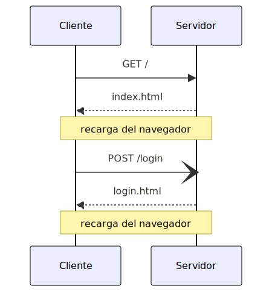

# Repaso BBDD 2º trimestre

## Backend 101

Este trimestre nos hemos centrado en aprender a crear aplicaciones web en el lado del servidor. Hemos aprendido a crear rutas, manejar solicitudes y respuestas, y a usar middlewares y vistas.

---
## Introducción

A principios de 1945, Vannevar Bush publicó un artículo en la revista The Atlantic Monthly titulado "As We May Think". En este artículo, Bush propuso un sistema de almacenamiento y recuperación de información que llamó "memex". 

---


El memex era un dispositivo mecánico que almacenaba y recuperaba información en microfilm. El usuario podía navegar por la información utilizando un teclado y una pantalla.

---

## Hipertexto

El hipertexto es un sistema de escritura que permite a los usuarios navegar por la información de manera no lineal. El hipertexto se basa en la idea de que la información se puede organizar en una red de nodos y enlaces.

---

## FRESS

En 1960, Ted Nelson desarrolló un sistema de hipertexto llamado FRESS (File Retrieval and Editing System). FRESS permitía a los usuarios crear, editar y navegar por documentos de texto utilizando enlaces. FRESS fue uno de los primeros sistemas de hipertexto y es considerado como un precursor de la web.

---

## WWW

En 1989, Tim Berners-Lee propuso un sistema de hipertexto llamado World Wide Web (WWW). El WWW fue diseñado para permitir a los usuarios navegar por la información de manera no lineal. En 1990 se crea la primera página web y en 1993 se lanza el primer navegador web de uso general.

---
<!-- class: lead -->

## Web 1.0


La estructura de la web 1.0 es simple, disponemos de un servidor que almacena documentos de hipertexto y un cliente que los visualiza, podemos acceder a los documentos mediante enlaces (anchors).

---
<!-- class: invert -->

## Solo lectura

La web 1.0 es un sistema de hipertexto que permite a los usuarios **consumir** información de manera no lineal, pero es un sistema de **solo lectura**. Los usuarios no pueden **crear** ni **editar** la información. Es la web que se usaba en los años 90.

---

<!-- class: lead -->
## Web tradicional



HTML 2.0 (1995) introdujo **formularios**, que permiten a los usuarios enviar datos al servidor. Esto permitió a los usuarios **crear** y **editar** la información. La web 2.0 es un sistema de hipertexto que permite a los usuarios **consumir**, **crear** y **editar** información de manera no lineal.

---
<!-- class: invert -->

## AJAX

En js en el año 1999 se introduce la tecnología **XMLHttpRequest** (XHR) que permite a los clientes enviar y recibir datos del servidor desde el cliente en javascript. Esto permitió a los clientes **consumir**, **crear** y **editar** información de manera no lineal, ahora sin necesidad de recargar la página.

---
<!-- class: lead -->

## SPA 

(Single Page Application)

La aparición de AJAX permitió a los desarrolladores crear aplicaciones web que funcionan como aplicaciones de escritorio. Estas aplicaciones se cargan en una sola página y se actualizan dinámicamente a medida que el usuario interactúa con ellas.


---
<!-- class: invert -->

## Tecnologias AJAX

- **XMLHttpRequest** (XHR) (1999)
- **JSON** (2001)
- **XML** (2001)
- **AJAX** (2005)
- **React** (2013)
- **Vue** (2014)
- **Fetch API** (2015)
- **Promises** (2015)
- **Angular** (2016)
- **Async/Await** (2017)

---

## Hypermedia Driven Apps

Las aplicaciones Hypermedia Driven se centran en ampliar las capacidades del propio lenguaje `HTML` evitando la necesidad de utilizar tecnologías adicionales como `AJAX` o frameworks como `React` o `Vue`.

---

Las HDA nos permiten **consumir**, **crear** y **editar** información de manera no lineal, sin necesidad de recargar la página, utilizando únicamente `HTML`. 

---

## Agnosticidad

Las aplicaciones Hypermedia Driven son **agnosticas** al servidor, es decir, no necesitan conocer la estructura de los datos ni la lógica de negocio del servidor para poder **consumir**, **crear** y **editar** información.

Esto hace que las aplicaciones Hypermedia Driven sean **más flexibles** y **fáciles de mantener** que las aplicaciones tradicionales.

---

## NodeJS

---

NodeJS es un entorno de ejecución de JavaScript que permite a los desarrolladores crear aplicaciones de servidor en JavaScript. NodeJS es un entorno de ejecución de JavaScript que permite a los desarrolladores crear aplicaciones de servidor en JavaScript.

---

Node nos permite lanzar scripts localmente mediante

`node script.js`

---

Si lanzas `node` sin argumentos, se abrirá un terminal interactivo donde puedes ejecutar código javascript directamente.

---

Tambien incluye varios modulos como:

- [Importaciones](https://dambbdd.neocities.org/04_nodejs/01_modulos)
- [filesystem](https://dambbdd.neocities.org/04_nodejs/02_filesystem)
- [path](https://dambbdd.neocities.org/04_nodejs/path)
- [os](https://dambbdd.neocities.org/04_nodejs/03_os)
- [http](https://dambbdd.neocities.org/04_nodejs/04_http)

---

Podemos instalar otros modulos y librerias mediante diferentes gestores como `npm` o `yarn`.

`npm init -y` nos deja iniciar rapidamente un proyecto con npm.

---
Esto creará un `package.json` que nos permitirá instalar modulos y librerias mediante `npm install <nombre>`.

```json
{
  "name": "backend101",
  "version": "1.0.0",
  "description": "",
  "main": "index.js",
  "scripts": {
    "test": "echo \"Error: no test specified\" && exit 1"
  },
  "keywords": [],
  "author": "",
  "license": "ISC"
}
```
---

## Express

---

Express es un framework de aplicaciones web para Node.js. Es minimalista y flexible, proporciona un conjunto de características robusto para desarrollar aplicaciones web y móviles.

---

Express nos permite crear un servidor web con muy pocas lineas de código.

```javascript
const express = require('express');
const app = express();

app.get('/', (req, res) => {
  res.send('Hello World!');
});

app.listen(3000, () => {
  console.log('Example app listening on port 3000!');
});
```

---

## Rutas

---

Las rutas son una forma de definir las URLs a las que responde nuestra aplicación. 

```javascript
app.get('/', (req, res) => {
  res.send('Hello World!');
});
```

Cada ruta consta de:
- Un método HTTP
- Una URL
- Una función que maneja la petición y da una respuesta

---

Podemos definir rutas con parametros en la url y capturarlos con `req.params`

```javascript
app.get('/pokemon/:id', (req, res) => {
    const id = req.params.id;
    const pokemon = getPokemon(id)
    res.send(pokemon);
});
```

En el ejemplo, el usaurio debe mandar la solicitud `GET /pokemon/1`

---

Podemos capturar parametros de la query mediante `req.query`

```javascript
app.get('/pokemon', (req, res) => {
    const id = req.query.id;
    const pokemon = getPokemon(id)
    res.send(pokemon);
});
```

En el ejemplo, el usuario deberia mandar la solicitud `GET /pokemon?id=1`

---

También podemos capturar parametros de la query mediante `req.body`, esto se hace cuando nos llegan datos de un `<form>` o con `AJAX` mediante un `POST`.

```javascript
app.post('/mensajes', (req, res) => {
    const mensaje = req.body.mensaje;
    if(!mensaje) return res.status(400).json({error: 'mensaje vacio'});
    addMensaje(mensaje);
    res.json({mensaje: mensaje, status: 200});
});
```
---

# Envio de datos

---
## Envio mediante `<form>`

```html
<form action="/mensajes" method="post">
  <input type="text" name="mensaje">
  <input type="submit" value="Enviar">
</form>
```
    
- Necesitaremos configurar `action` y `method` en el `<form>` con la ruta y método HTTP correspondientes.
- Cada `<input>` debe tener un `name` que será el nombre del parametro que se enviará, junto al valor que ingrese el usuario en el `<input>`.

---
## Envio mediante `XMLHttpRequest`

```javascript
const xhr = new XMLHttpRequest();
xhr.open('POST', '/mensajes', true);
xhr.setRequestHeader('Content-Type', 'application/x-www-form-urlencoded');
xhr.send('mensaje=Hola');
```
---
## Envio mediante `fetch`

```javascript
fetch('/mensajes', {
  method: 'POST',
  headers: {
    'Content-Type': 'application/x-www-form-urlencoded'
  },
  body: 'mensaje=Hola'
})
.then(response => response.json())
.then(data => manipulaRespuesta(data));

function manipulaRespuesta(data){
    //aqui puedes usar la respuesta del servidor
}
```

---
En todos estos casos, si en nuestra ruta queremos capturar el parametro `mensaje` del `body`, deberemos usar el middleware `express.urlencoded` para parsear el `body` de la solicitud.

```javascript
app.use(express.urlencoded({ extended: true }));
```
---

Podemos usar varias solicitudes HTTP para la misma ruta

```javascript
const libros = [
  { id: 1, titulo: 'El problema de los tres cuerpos' },
  { id: 2, titulo: 'El alquimista y la puerta de acero' },
  { id: 3, titulo: 'Snuff' }
];
app.use(express.urlencoded({ extended: true }));
app.get('/libro', (req, res) => {
    const libro = libros[Math.floor(Math.random() * libros.length)];
    res.json(libro);
  })

app.post('/libro', (req, res) => {
    const libro = req.body.titulo;
    libros.push({ id: libros.length + 1, titulo: libro });
    res.send('Libro añadido');
  })

app.put('/libro', (req, res) => {
    const id = req.body.id;
    const libro = req.body.titulo;
    libros[id - 1] = { id: id, titulo: libro };
    res.send('Libro actualizado');
  });
```

---

## Routers

Los routers nos dejan dividir nuestra aplicacion en modulos mas pequeños.

---

Necesitarás crear un archivo donde hagas todas las rutas que quieras usar y exportarlas:

```javascript
// ./routes/test.js
const express = require('express');
const router = express.Router();

router.get('/', (req, res) => {
  res.send('Hello World!');
});

module.exports = router;
```
---
Y luego importarlas y usarlas en tu servidor:
```javascript
//en tu archivo principal
const express = require('express');
const app = express();

const routerTest = require('./routers/test');
const routerMensajes = require('./routers/mensajes');
app.use('/mensajes', routerMensajes);
app.use(routerTest);

app.listen(3000, () => {
  console.log('Example app listening on port 3000!');
});
```

---

## Middlewares

Los middlewares son funciones que se ejecutan antes de que se ejecute la función que maneja la petición.

---

Podemos usar middlewares para:
- Validar datos
- Autenticar usuarios
- Loggear peticiones
- Manejar errores

---

```javascript
app.use((req, res, next) => {
  console.log('Time:', Date.now());
  next();
});
```

En este ejemplo, el middleware loggea la fecha y hora de la solicitud y luego llama a `next()` para que se ejecute la función que maneja la petición o el siguiente middleware.

---

Podemos crear middleware en forma de funciones y usarlas en nuestras rutas.

```javascript
function loggea(req, res, next){
    console.log('Time:', Date.now());
    next();
}

app.use(loggea);
```

En este caso, configuramos todas las rutas para usar el middleware que hemos creado.

---

Tambien podemos usarlo solo en una ruta en particular.

```javascript
app.get('/libro', loggea, (req, res) => {
    const libro = libros[Math.floor(Math.random() * libros.length)];
    res.json(libro);
  })
```

---

Tenemos varios middlewares que vienen incluidos con `Express`, entre ellos:

- `express.json()`, para parsear el `body` de la solicitud en formato `json`.
- `express.urlencoded()`, para parsear el `body` de la solicitud en formato `x-www-form-urlencoded`.
- `express.static()`, para servir archivos estáticos.
- `express.Router()`, para crear rutas modulares.

---

Tambien podemos descargar middlewares de terceros como `morgan`, `cors`, `express-session`.

Instalalos mediante `npm install nombre_del_middleware` y luego usalos mediante `app.use()` como con los middlewares anteriores.

---

Algunos middleware de terceros necesitarán configuración adicional, por ejemplo, con morgan debemos definir el formato de loggeo que queremos usar.

```javascript
const morgan = require('morgan');
app.use(morgan('tiny'));
```

---

En el caso de express-session necesita un hash secreto y las opciones deseadas: 

```javascript
const session = require('express-session');
app.use(session(
    { 
    secret: 'qwerty', 
    resave: false, 
    saveUninitialized: true 
    }));
```

`resave` hace que la sesión se guarde en el servidor en cada solicitud, `saveUninitialized` hace que se guarde la sesión aunque no haya sido modificada y `secret` es el hash secreto que se usará para firmar la cookie de la sesión.

---

## Vistas

---

Las vistas son archivos que se renderizan en el servidor y se envian al cliente. Podemos usar `HTML`, aunque es común usar un lenguaje de templating como `pug`, `ejs` o `nunjucks`.

---

Para usar las vistas debemos configurar el motor de vistas que queremos usar.

```javascript
const pug = require('pug');
app.set('view engine', 'pug');
```

```javascript
const nunjucks = require('nunjucks');

nunjucks.configure('views', {
  autoescape: true,
  express: app
});

app.set('view engine', 'njk');
```

---

Luego podemos renderizar las vistas en nuestras rutas:

```javascript
app.get("/", (req, res) => {
    const mensaje = "Hola mundo!"
    const lista = ["a", "b", "c"]
    res.render('index', {mensaje, lista});
})
```

En este caso, esta ruta renderiza `views/index.njk` y la envia al usuario.

---

Si estais montando una HDA, tus respuestas deben ser `html`, debeis renderizar html parcialmente y enviarlo al cliente, podemos usar `nunjucks.render()` para renderizar un archivo y enviarlo al cliente.

```javascript
app.get("/pokemon/:id", (req, res) => {
    const id = req.params.id;
    const pokemon = getPokemon(id)
    const html = nunjucks.render('pokemon.njk', {pokemon});
    res.send(html);
})
```

---


